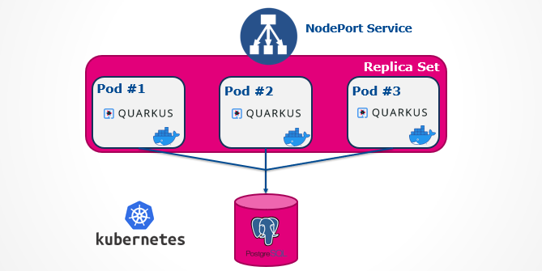

# Expand-Contract Pattern applied in Rolling Upgrade Deployment

## Technologies used

* Java 11
* Maven
* Quarkus framework
* Docker
* Kubernetes
* Jib
* HTML/CSS/JS
* Weave Scope visualisation & monitoring tool
* PostgreSQL
* Flyway 

## Techniques used

* [Rolling Updates](https://en.wikipedia.org/wiki/Rolling_release)
* [Expand/Contract pattern](https://martinfowler.com/bliki/ParallelChange.html)
* [Evolutionary Database Design](https://databaserefactoring.com/index.html)

## Architecture



## Packaging and running the example in a kubernetes cluster

1. Run a local docker registry (Minikube - `minikube addons enable registry`) and forward registry port:
```
kubectl port-forward --namespace kube-system registry-<id> 5000:5000
```

2. Run the deployment script:
```
./minikube-deploy.sh
```

3. Access the application on `http://<Minikube NodeIP>:30036`

4. Access WeaveScope on `http://localhost:4040`
