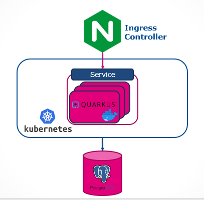

# Expand-Contract Pattern applied in Rolling Upgrade Deployment

## Technologies used

* Java 11
* Maven
* Quarkus framework
* Docker
* Kubernetes
* Jib
* HTML/CSS/JS
* Weave Scope visualisation & monitoring tool
* PostgreSQL
* Flyway 

## Techniques used

* [Rolling Updates](https://en.wikipedia.org/wiki/Rolling_release)
* [Expand/Contract pattern](https://martinfowler.com/bliki/ParallelChange.html)
* [Evolutionary Database Design](https://databaserefactoring.com/index.html)


## Architecture



## Packaging and running the example in a kubernetes cluster

1. Start `minikube` with the following addons:
```
minikube start --addons registry, ingress
```

2. Forward the image registry port:
```
kubectl port-forward --namespace kube-system registry-<id> 5000:5000
```

3. Run the deployment script:
```
./minikube-deploy.sh
```

4. Get `ngnix` IP from `ADDRESS` column using:
```
kubectl get ingress -n custom
```

5. Map `customer.domain` to the IP provided by step above to `etc/hosts`

6. Access the application on `http://customer.domain`

## Expand/Contract demo explanation

Beside `master` branch you have 3 additional branches that represent 3 backward compatible database versions.

### The problem:
> You need to split **name** column into two separate columns, **first name** and **last name** and to maintain backward compatibility with the previous version.

### Solution:

| Migration version | Branch                 | State    | What happens to the database?                                                                                                                  |
|-------------------|------------------------|----------|------------------------------------------------------------------------------------------------------------------------------------------------|
| V1.0              | demo/v1_starting_state | Starting | Create a **customer** table that contains an **ID** and a **name**                                                                             |
| V2.0              | demo/v2_expand_state   | Expand   | Append **first_name** and **last_name** column. Bidirectional synchronization using triggers between **name** and **(first_name, last_name)**  |
| V3.0              | demo/v3_contract_state | Contract | After all clients migrated to V2.0, in this state you can remove the old column **name** and also the synchronization triggers.                |
